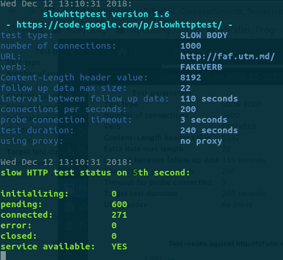
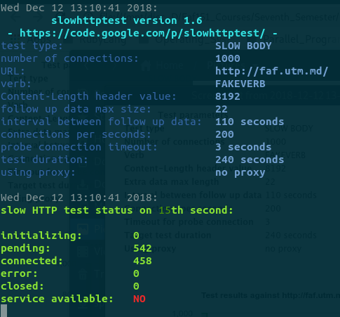
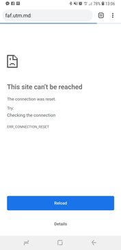
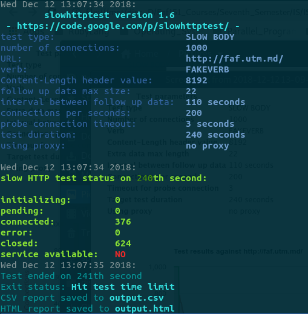
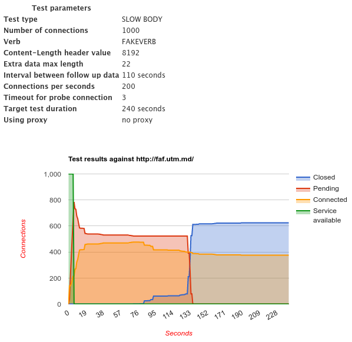

# Laboratory work 3
## Slow loris attack

**Slowloris** is a type of denial of service attack tool invented by Robert "RSnake" Hansen which allows a single machine to take down another machine's web server with minimal bandwidth and side effects on unrelated services and ports.

Slowloris tries to keep many connections to the target web server open and hold them open as long as possible. It accomplishes this by opening connections to the target web server and sending a partial request. Periodically, it will send subsequent HTTP headers, adding to—but never completing—the request. Affected servers will keep these connections open, filling their maximum concurrent connection pool, eventually denying additional connection attempts from clients.

## Slowhttptest

**slowhttptest** - Denial Of Service attacks simulator.

The slowhttptest implements most common low-bandwidth Application Layer DoS attacks and produces CSV and HTML files with test statistics. More about it can be found [here](https://www.google.com "slowhttptest").

### Install
Type this in the terminal depending on the package manager that you are using. For my linux disto it is **pacman**
```bash
sudo pacman -S slowhttptest
```
### How to use

Execute the command and wait. We checked the
[faf.utm.md](http:/faf.utm.md "faf site"). site.
```bash
slowhttptest -c 1000 -B -g -o output -i 110 -r 200 -s 8192 -t FAKEVERB -u http://faf.utm.md -x 10 -p 3
```
As we can see it takes some time for slowloris attack to stop the site from working. After 5 sec it is alive.



After 15 seconds it stopped working. As we can see we need just arround 400 connections.



This was checked



At the end we obtained a 2 file **output.csv** and **output.html** file with a little report about how things worked.




