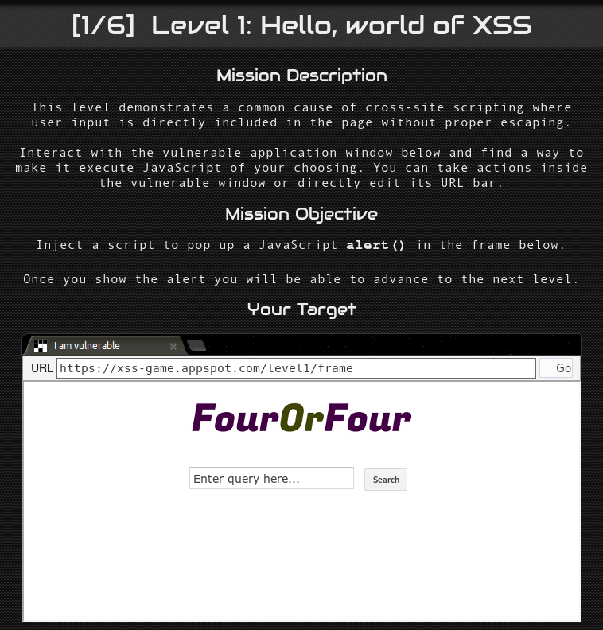
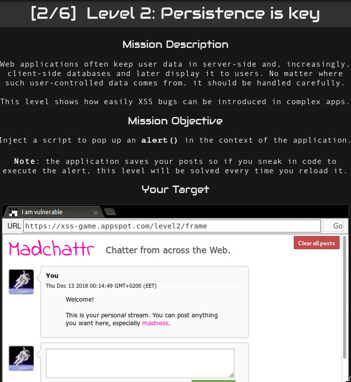
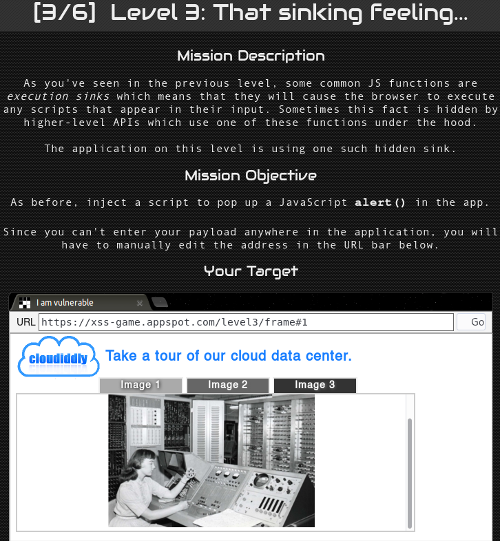
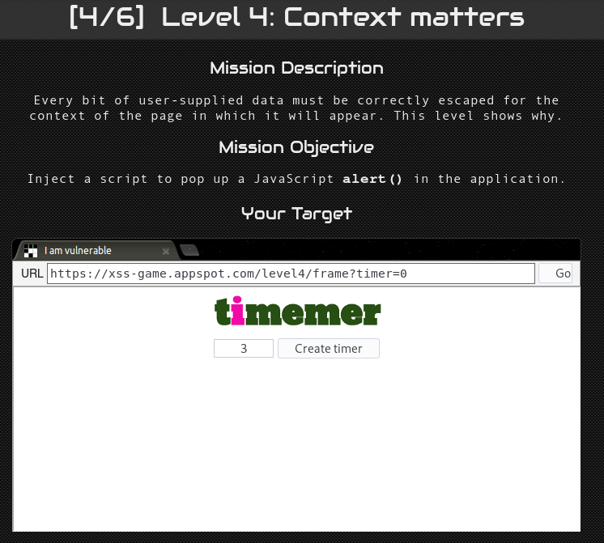
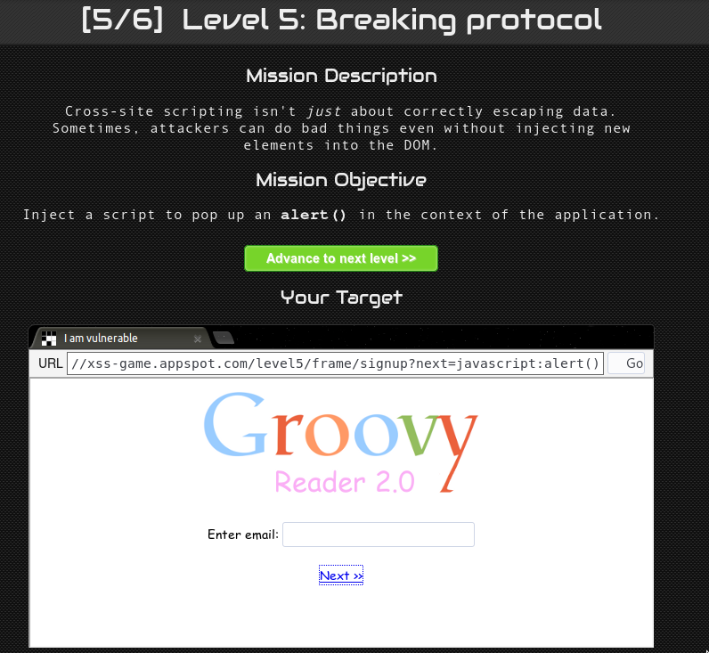
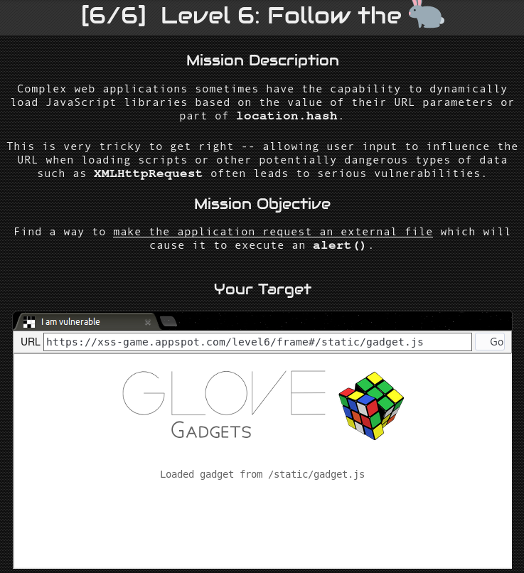

# Laboratory work 4
## XSS attack

**Cross-Site Scripting** (XSS) attacks are a type of injection, in which malicious scripts are injected into otherwise benign and trusted websites. XSS attacks occur when an attacker uses a web application to send malicious code, generally in the form of a browser side script, to a different end user. Flaws that allow these attacks to succeed are quite widespread and occur anywhere a web application uses input from a user within the output it generates without validating or encoding it.

An attacker can use XSS to send a malicious script to an unsuspecting user. The end user’s browser has no way to know that the script should not be trusted, and will execute the script. Because it thinks the script came from a trusted source, the malicious script can access any cookies, session tokens, or other sensitive information retained by the browser and used with that site. These scripts can even rewrite the content of the HTML page. For more details on the different types of XSS flaws, see: Types of Cross-Site Scripting.

## Example
As an example we used [xss-game](https://xss-game.appspot.com/ "xss-game").
This game provides 6 levels with increasing difficulty. To acces the next level you need to pass them in a sequence.
Each level has a short description and a target that you should attack using XSS.

1. simple script injection

2. using img tag with the **onerror** attribute, so that when image is not found onerror is executed.

3. adding **onclick** to the url so that when image is clicked alert() is executed.

4. Injecting an alert using the query

5. Adding alert when next is clicked

6. Exesing external file by adding **data:javascript** to the query, and then the alert() after a comma.

##Conclusion
It was pretty cool to learn about XSS attacks especially using practical staff.
